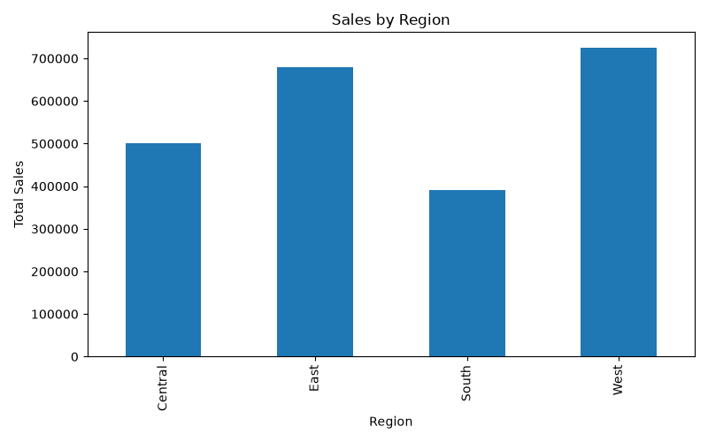
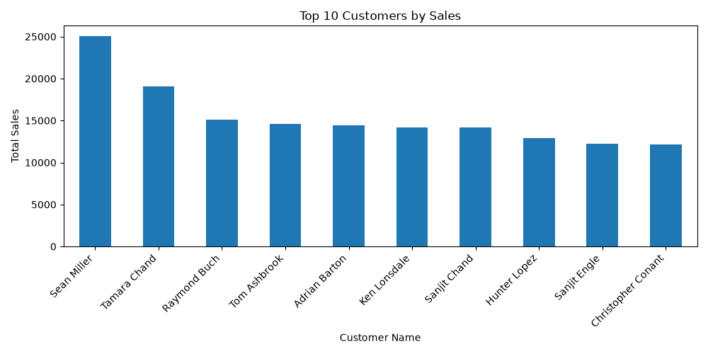
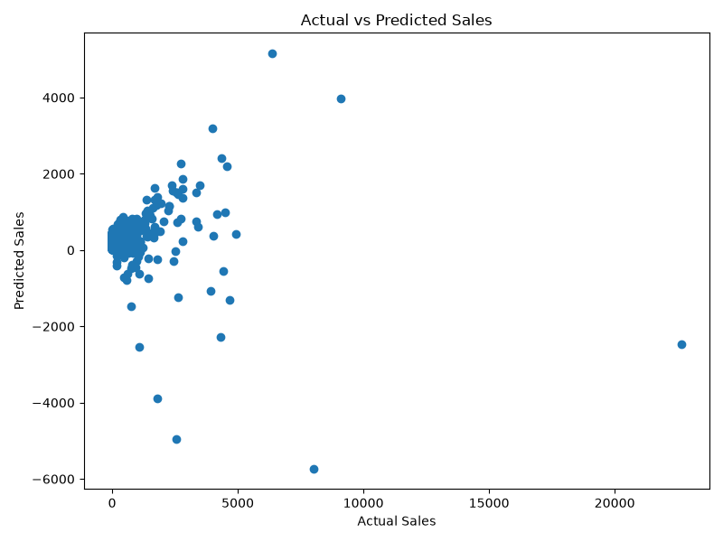

# 📊 Retail Sales Analysis and Prediction using Python
## 📌 Project Overview
This project analyzes a real-world retail sales dataset and builds a Machine Learning model to predict sales. It includes data cleaning, exploratory data analysis (EDA), data visualization, and sales prediction using Linear Regression.
---
## 🎯 Objectives
- Analyze retail sales data
- Identify sales trends and patterns
- Visualize important business insights
- Build a Machine Learning model for sales prediction
- Evaluate model performance
---
## ✨ Features
- Data Cleaning and Preprocessing
- Exploratory Data Analysis (EDA)
- Business Data Visualizations
- Sales Trend Analysis
- Customer Sales Analysis
- Sales Prediction using Linear Regression
- Model Performance Evaluation
## 🛠️ Technologies Used
- Python
- Pandas
- NumPy
- Matplotlib
- Scikit-learn
---
## 📂 Dataset
- Source: Kaggle - Sample Superstore Dataset
- Dataset: Sample Superstore Dataset
- Total Records: 9,994
- Total Columns: 21
---
## 📊 Project Workflow
### 1. Data Loading
- Loaded the retail sales dataset using Pandas.
### 2. Data Cleaning
- Checked missing values
- Removed duplicate records
### 3. Exploratory Data Analysis (EDA)
- Total Sales
- Total Profit
- Average Sales
- Highest & Lowest Sales

### 4. Data Visualization
- Sales by Category
- Sales by Region
- Monthly Sales Trend
- Top 10 Customers by Sales
### 5. Machine Learning
- Linear Regression Model
- Train-Test Split
- Sales Prediction
### 6. Model Evaluation
- Mean Absolute Error (MAE)
- R² Score
---
## 📈 Visualizations
- Sales by Category
- Sales by Region
- Monthly Sales Trend
- Top 10 Customers
- Actual vs Predicted Sales
---
## 📷 Project Screenshots
### Sales by Category

### Sales by Region

### Monthly Sales Trend

### Top 10 Customers

### Actual vs Predicted Sales

## 📁 Project Structure
```
Retail_Sales_Project/
│
├── Sample - Superstore.csv
├── retail_project.py
├── README.md
├── requirements.txt
│
└── output/
    ├── category_sales.png
    ├── region_sales.png
    ├── monthly_sales.png
    ├── top_customers.png
    ├── actual_vs_predicted.png
    └── sales_predictions.csv
```
---
## 🚀 How to Run
1. Clone the repository
```bash
git clone <repository-link>
```
2. Install dependencies
```bash
pip install -r requirements.txt
```
3. Run the project
```bash
python retail_project.py
```
---
## 📊 Results
- Analyzed 9,994 retail sales records.
- Identified sales trends across categories, regions, and months.
- Visualized customer purchasing patterns.
- Built a Linear Regression model for sales prediction.
- Evaluated the model using MAE and R² Score.
- Saved all visualizations and prediction results in the output folder.
- Successfully analyzed retail sales data
- Generated multiple business insights through visualizations
- Built a Linear Regression model for sales prediction
- Saved prediction results and graphs in the output folder
---
## 🔮 Future Improvements
- Use Random Forest Regressor
- Use XGBoost
- Feature Engineering
- Hyperparameter Tuning
- Build an interactive dashboard using Streamlit or Power BI
---
## 👩‍💻 Author
**Guna M. S. Dhana Naga Venkata Durga Sruthi**
GitHub: *(Add your GitHub profile link here)*
LinkedIn: *(Add your LinkedIn profile link here)*
